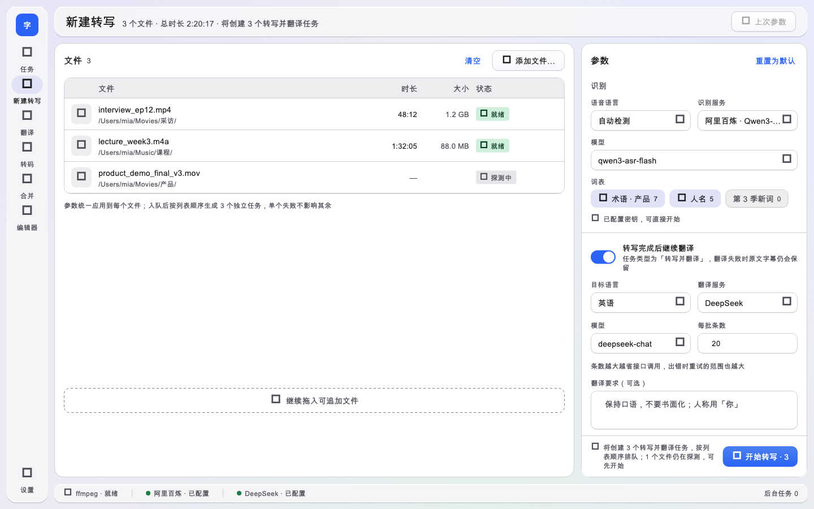
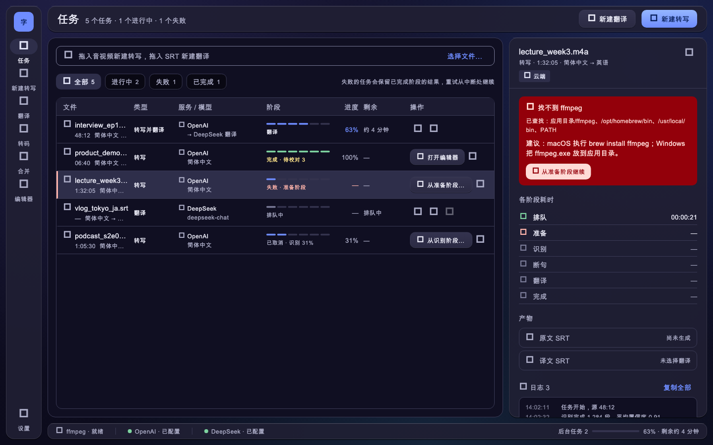

# 字幕工具 · 仓库设计系统

Codex 继续维护本应用的 UX/UI。本文从 Flutter 实现、现有页面需求和已提交截图重建设计标准，替代对 Claude Design 项目的运行依赖。原项目的可用性未核实；任何新设计与实现都应能在本仓库内完成。

## 依据与维护方式

本次重建基于 `Joycai-main` 的 `b988b33d`。本次只建立设计契约，不改变应用外观或覆盖截图。

| 依据 | 用途 |
| --- | --- |
| [tokens.dart](../app/lib/core/theme/tokens.dart) | 间距、圆角、字体、动效、状态透明度的实际数值 |
| [app_theme.dart](../app/lib/core/theme/app_theme.dart) | ColorScheme、文字层级、Material 控件主题 |
| [app_extensions.dart](../app/lib/core/theme/app_extensions.dart) | 成功色、说话人色、玻璃、渐变与阴影 |
| [core/widgets](../app/lib/core/widgets/) 与 [features/shared](../app/lib/features/shared/) | 可复用组件与工作台模式 |
| [golden](../app/test/golden/) | 已实现页面的视觉参考与回归基线 |
| [历史需求索引](design-prompts/README.md) | 页面意图与交互细节；外部画板不是开发前提 |

代码是实际渲染值的来源，本文解释用途与约束。改变令牌或共享组件时同步更新本文；有意改变外观时说明原因并核对相应截图。历史需求与当前行为冲突时先读控制器、测试及 [app/README.md](../app/README.md)，明确记录差异，不能凭旧稿改变保存或任务规则。

## 视觉方向

桌面字幕工作台：信息密度适中、文字优先、蓝色动作、冷色背景、克制的玻璃导航。浅色为白色内容面板与灰色分层；深色为独立调校的深靛色表面，不通过反色生成。

玻璃只用于导航栏、顶栏、状态栏及浮层（对话框、菜单、任务详情）。内容表格和参数面板使用不透明底色、1px 描边分层，不增加背景模糊或装饰性插画。沿用 Material Symbols Rounded、weight 400；尺寸按已有组件取值。

## 颜色契约

下表为常用角色的速查，完整值以主题代码为准。界面通过 `context.colors` / `context.ext` / `context.glass` / `context.elevation` 取值，不在页面复制 hex。

| 角色 | 浅色 | 深色 | 用途 |
| --- | --- | --- | --- |
| primary | `#2A63F5` | `#6E8CFF` | 主要动作、焦点、链接 |
| primaryContainer | `#E3E9FF` | `#3556C8` | 蓝色容器，配对应 on 色 |
| secondaryContainer | `#E0E2F5` | `#2E2E4A` | 导航选中等次级状态 |
| surface | `#F5F5F7` | `#16152A` | 基础表面 |
| surfaceContainerLowest | `#FFFFFF` | `#100F22` | 不透明内容面板 |
| surfaceContainer | `#E6E6EA` | `#232238` | 中性提示与分层 |
| onSurface | `#1C1C1E` | `#E6E6F2` | 正文 |
| onSurfaceVariant | `#50505A` | `#A9AAC4` | 标签、说明、次要信息 |
| outlineVariant | `#CFCFD6` | `#3A3A55` | 面板边界与分隔线 |
| error | `#B3261E` | `#FFB4AB` | 错误、失败；容器配 errorContainer/onErrorContainer |
| success | `#1F7A45` | `#7ED4A0` | 完成、就绪、连接状态 |
| tertiary | `#7A5C00` | `#F2CE4E` | 当前播放字幕、待校对 |
| tertiaryContainer | `#FFE58A` | `#5C4700` | 上述字幕状态的容器 |

黄色不作为通用警告或 CTA 色。说话人编号使用 `AppColors.speaker(id)` 的八色循环，只染徽标底色，文字用 onSurface，不染整行。进度的蓝紫渐变使用 `AppElevation.progressGradient`；不把紫色扩展为通用动作色。已有深色表面、壁纸与说话人徽标的偏紫色仍保留。

玻璃浅色：普通 `0xC7FFFFFF`、强档 `0xE6FFFFFF`；深色：普通 `0xD1232238`、强档 `0xED232238`。由 `GlassPanel` 提供亮边、顶部 1px 高光和阴影；正文容器用 `ContentPanel`。

## 字体、密度与动效

| 角色 | 字号 / 行高 | 字重 |
| --- | --- | --- |
| displaySmall | 36 / 44 | 500 |
| headlineSmall | 24 / 32 | 500 |
| titleLarge（顶栏） | 22 / 28 | 500 |
| titleMedium / titleSmall | 16 / 24、14 / 20 | 600 |
| bodyLarge / bodyMedium / bodySmall | 16 / 24、14 / 20、12 / 16 | 默认 |
| labelLarge / labelMedium / labelSmall | 14 / 20、12 / 16、11 / 16 | 500 |
| timecode | 13 / 20 | 500、等宽、表格数字 |

正文使用 `AppFonts.sansFallback`（Noto Sans SC 与各平台 CJK 回退）；时间码、命令等使用 `AppFonts.monoFallback`。字体未随应用打包，不能承诺各系统像素一致。文件名和路径按现有组件排版；长路径保留省略、提示或复制入口。

间距阶梯：4、8、12、16、20、24、32、48 logical px；用 `AppSpacing`。圆角：4、6、10、16、20；控件通常 10，面板 16，对话框 20。常规按钮和控件高 36，dense 控件按钮 32；图标动作沿用组件现有尺寸，不统一拉成圆形。Material 主题使用 compact density。

动效使用 `AppDuration` 的 100 / 200 / 300ms 与 `AppEasing`。状态透明度：hover 8%，focus/pressed 12%，disabled container 12%，disabled content 38%。不要让禁用状态只靠变淡表达原因。窗口背景复用 `AppWallpaper` / `BakedBackdrop` 的静态烘焙，避免逐帧重画全窗口渐变。

## 布局契约

| 区域 | 实际规则 | 来源 |
| --- | --- | --- |
| 应用外壳 | 外边距与间隙 12；Rail 宽 72；顶栏高 52；状态栏高 32 | [app_shell.dart](../app/lib/features/shell/app_shell.dart) |
| 导航 | 任务 / 新建转写 / 翻译 / 转码 / 合并 / 编辑器；设置固定底部 | [nav_rail.dart](../app/lib/features/shell/nav_rail.dart) |
| 四个建任务页 | 左侧文件弹性宽，右参数宽 400；内容可用宽 <1100 时参数 360；<960 时上下排列 | [new_task_page.dart](../app/lib/features/shared/new_task_page.dart) |
| 编辑器入口 | 右侧面板按内容可用宽 <1100 切为 360，否则 400 | [editor_open_page.dart](../app/lib/features/editor/editor_open_page.dart) |
| 编辑器工作区 | 检视面板 440；窗口宽 <1100 时 380，工具栏与说话人列收紧 | [editor_page.dart](../app/lib/features/editor/editor_page.dart)、[editor_widgets.dart](../app/lib/features/editor/editor_widgets.dart) |
| 设置 | 目录 208，内容限宽 880；窗口 <1180 目录变顶部 tabs，<1000 标签上下堆叠 | [settings_page.dart](../app/lib/features/settings/settings_page.dart) |

建任务页的阈值取 LayoutBuilder **内容宽度**，设置和编辑器工作区取**窗口宽度**；不要把两者混用。1440×900 是常用截图参考，不是唯一支持尺寸。复用当前滚动与固定页脚机制，窄窗口不能让开始按钮、错误解释或关键输入框消失。

## 组件选择

| 需求 | 优先复用 |
| --- | --- |
| 主操作 / 次操作 / 安静操作 / 图标动作 | [buttons.dart](../app/lib/core/widgets/buttons.dart) 的 PrimaryButton / ControlButton / QuietButton / IconActionButton |
| 标签、输入表皮、分组下拉、表单段 | [fields.dart](../app/lib/core/widgets/fields.dart) 公共入口；LabeledField / ControlSurface / AppDropdown |
| 参数分区、页头与提交反馈 | [param_section.dart](../app/lib/features/shared/param_section.dart)、[new_task_panels.dart](../app/lib/features/shared/new_task_panels.dart)、[page_chrome.dart](../app/lib/features/shared/page_chrome.dart) |
| 服务、模型、词表 | [provider_fields.dart](../app/lib/features/shared/provider_fields.dart)、[features/shared](../app/lib/features/shared/) 现有组件 |
| 中性反馈 / 状态与进度 | [note_bar.dart](../app/lib/core/widgets/note_bar.dart)、[indicators.dart](../app/lib/core/widgets/indicators.dart) |
| 玻璃浮层 / 对话框 | [glass_panel.dart](../app/lib/core/widgets/glass_panel.dart)、[glass_dialog.dart](../app/lib/core/widgets/glass_dialog.dart) |

共享的基础控件放 core/widgets；带业务语义的跨页组件放 features/shared。先复用已有组件，再考虑扩展 API；不把样式复制到各 feature。

## 交互与文案契约

- 文案用简短中文陈述句、半角数字，不加 emoji 或感叹号。错误说明发生了什么、影响哪条文件/参数，以及可执行的下一步。
- 空态保留添加文件或打开字幕入口；拖放同时提供按钮路径。无效输入保留用户已填内容；禁用选项给原因，页脚解释为何不能开始。
- 建任务页切换导航保留文件与参数；成功入队清空文件、保留参数，显示入队数量和查看任务入口，不强制跳走。任务进度、取消和从中断处继续保持现有语义。
- 设置即时保存，反馈在相应分区，不新增全页保存按钮。编辑进度自动存与字幕文件手动写入是两个动作，导出是另存；冲突、只读运行态与离开确认按控制器规则实现。
- 快捷键使用 `AppShortcut` / `ShortcutAction`，macOS 用主修饰键 ⌘，其他平台 Ctrl；遵循现有焦点范围与输入法处理。不能用全局按键猜测用户是否在编辑。
- 新增或改动控件检查 Tab/Shift+Tab、可见焦点、键盘触发、tooltip 与 semantics；重要状态同时有文字/图标，不能只用颜色。现有自绘控件并未因此被认定为已全部满足可访问性。
- 对新增颜色组合分别检查浅/深色实际合成背景上的对比度：普通文字目标 4.5:1，大文字及关键非文字边界目标 3:1。本文记录目标，不声称本次完成全量 AA 审计。

## 本地视觉参考

以下是已有 Flutter 测试产物。它们可在没有外部画板时定位布局、密度和状态；部分图标显示为方框，是字体加载限制，不是设计元素。

其他状态入口：

| 页面 | 浅色 / 深色 | 关键状态 |
| --- | --- | --- |
| 翻译 | [light](../app/test/golden/new_translate_page_light.png) / [dark](../app/test/golden/new_translate_page_dark.png) | [空态](../app/test/golden/new_translate_page_empty_light.png)、[阻塞](../app/test/golden/new_translate_page_blocked_light.png) |
| 转码 | [light](../app/test/golden/transcode_page_light.png) / [dark](../app/test/golden/transcode_page_dark.png) | [重混流](../app/test/golden/transcode_page_remux_light.png) |
| 合并 | [light](../app/test/golden/merge_page_light.png) / [dark](../app/test/golden/merge_page_dark.png) | [参数不一致](../app/test/golden/merge_page_mismatch_light.png)、[窄窗口](../app/test/golden/merge_page_narrow_light.png) |
| 编辑器 | [本地 light](../app/test/golden/editor_local_light.png) / [本地 dark](../app/test/golden/editor_local_dark.png) | [运行只读](../app/test/golden/editor_running_light.png)、[多选](../app/test/golden/editor_multi_select_light.png) |
| 设置 | [light](../app/test/golden/settings_page_light.png) / [dark](../app/test/golden/settings_page_dark.png) | [窄窗口](../app/test/golden/settings_page_narrow_light.png)、[模型状态](../app/test/golden/settings_page_states_light.png) |

## Codex 继续设计的流程

使用仓库 [subtitle-ui-design skill](../.agents/skills/subtitle-ui-design/SKILL.md)。每次改善先记录用户问题、页面/组件范围、要保留的行为和状态，针对真实工作流程制定变更。复杂改动在本地保存设计 brief，可使用 [brief 模板](design-brief-template.md)。历史 prompt 只作需求参考，无需打开旧项目或生成 `.dc.html`。

优先在真实 Flutter 页面上评审；探索性原型使用本设计系统，但不能以原型效果代替实际布局、焦点和保存验证。至少核对浅/深色、常用与窄窗口、空态/就绪/阻塞/运行/完成/失败中本次涉及的状态。

应用代码改动在 app 下运行 `flutter analyze`、`flutter test`，UI 改动再运行 `flutter test --tags golden --run-skipped`。只在有意的视觉变更核对后更新相关基线，报告变动截图和原因；审查阶段不更新基线。截图宿主字体不同造成的差异要说明，不能通过整批覆盖把问题隐藏。

## 后续改善顺序

本次完成设计接管；以下为建议的独立实施任务，尚未修改应用代码：

1. **视觉验证可移植性**：现有 render_test 的 CJK 加载候选为 macOS 路径，已提交截图还存在图标方框。先补齐确定性的 CJK / Material Symbols 测试字体策略，核对授权与体积，再建立可读的跨平台参考，避免每台机器覆盖基线。
2. **键盘与焦点一致性**：检查自绘 Tappable、LinkText、RadioRow、导航与按钮的焦点/语义/触发，复用已有焦点和快捷键机制；保留桌面紧凑密度。
3. **窄窗口与长内容**：使用长中文、长路径、服务/模型名、错误详情核对各页断点；修复被截断的原因说明或不可达操作，沿用现有布局模式。
4. **状态反馈一致性**：跨转写/翻译/转码/合并统一阻塞原因、探测中、入队反馈与重试描述，再检查编辑器保存反馈，保留每种任务的真实能力。

不依据未经验证的截图或旧原型直接重做全局主题。每个实施任务记录实际证据、行为测试与前后截图，新的设计决定回写本文。
